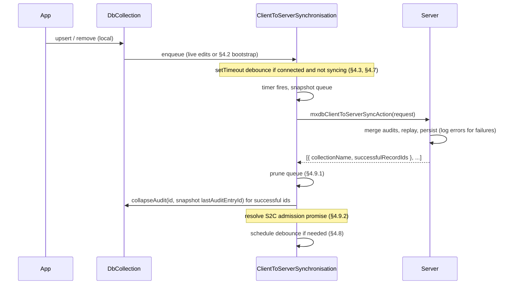

# Client→server synchronisation (batched audit sync)

This document specifies a **change in how the library pushes client-originated mutations to the server**. It replaces **immediate** per-change socket actions with a **debounced batch** driven by a client-side **`ClientToServerSynchronisation`** type, and introduces a dedicated action **`mxdbClientToServerSyncAction`** whose payload is smaller than a full “send every audit document” sync while preserving **audit replay** semantics on the server. **Server→client** delivery (**`mxdbServerToClientSyncAction`**, per-connection **`ServerToClientSynchronisation`** mirror, client **ack** with **`successfulRecordIds`** + **`deletedRecordIds`**) is documented in [server-to-client-synchronisation.md](./server-to-client-synchronisation.md).

**Target architecture:** **`ClientToServerSynchronisation`** and **`ServerToClientSynchronisation`** (and their socket actions) are the **only** mechanisms by which **records** are synchronised between client and server. There is **no** parallel **`mxdbSyncCollectionsAction`** / full-audit **`synchronise-collections`** path in this spec; older code may remain in the repository until migration completes.

For background on **local-first creates** and how they interact with upsert and audit flow, see [client-record-creation-sync.md](./client-record-creation-sync.md).

---

## 1. Goals

- **Reduce chatter**: Use a **debounced** **`mxdbClientToServerSyncAction`** batch instead of **per-change** socket traffic for normal local edits (see §3.1).
- **Stay audit-first**: The server still **merges** client audit data with its own and **replays** entries to materialise the authoritative record (same **merge → replay → persist** responsibilities as the server-side pipeline shared with historical full-sync handlers, e.g. [`processUpdates` in `syncAction.ts`](../../src/server/actions/syncAction.ts)).
- **Deterministic queueing**: Every logical record touched is represented at most once in the outbound queue (keyed by collection + record id), with a single **high-water** audit entry id per row.
- **Cold start**: A **one-time** scan of all collections and audits seeds the queue for anything that already had pending work before live **`enqueue`** wiring ran.
- **Offline-first timer**: Debounce runs only while **connected**; reconnecting restarts the timer when there is backlog.
- **Stable ordering vs server push**: After a successful **`mxdbClientToServerSyncAction`**, the client **immediately** **`collapseAudit`**s successful rows to the **`lastAuditEntryId`** that was **sent** in that batch; **`mxdbServerToClientSyncAction`** is **not** applied until **phase B** of §4.9 has **completed** (admission gate open).

Shared types for sync today live in [`src/common/models/internalSyncModels.ts`](../../src/common/models/internalSyncModels.ts). Audit entry kinds (including **Branched**) are defined in [`src/common/auditor/auditor-models.ts`](../../src/common/auditor/auditor-models.ts).

---

## 2. Legacy architecture (what exists today in code)

The table below describes **today’s** wiring; it is **not** the target end state once **`ClientToServerSynchronisation`** + **`ServerToClientSynchronisation`** fully replace **`mxdbSyncCollectionsAction`** / [`synchronise-collections.ts`](../../src/client/providers/sync/synchronise-collections.ts).

| Path | Role | Main code |
|------|------|-----------|
| Immediate push | On local upsert/remove (not `branched`), calls `mxdbUpsertAction` / `mxdbRemoveAction` when connected | [`ClientToServerProvider.tsx`](../../src/client/providers/client-to-server/ClientToServerProvider.tsx) |
| Full audit sync (**legacy**) | On connect / poll, sends **full** pending `AuditOf` payloads per collection | [`SyncProvider.tsx`](../../src/client/providers/sync/SyncProvider.tsx) → [`synchronise-collections.ts`](../../src/client/providers/sync/synchronise-collections.ts) → `mxdbSyncCollectionsAction` |
| Server handling | Merge + replay + persist + notify | [`syncAction.ts`](../../src/server/actions/syncAction.ts) (`processUpdates`, then `dbCollection.sync`, etc.) — **reuse** this logic inside the **`mxdbClientToServerSyncAction`** handler rather than maintaining a second reconciliation channel |

**Branched** audits: local reconciliation applies server answers via `upsert(..., 'branched', auditEntryId)` and `collapseAudit`. Those **`onChange`** events must **not** enqueue client→server pushes (same rule as today’s skip in `ClientToServerProvider`).

---

## 3. What this design changes

### 3.1 Stops

- **Normal** local creates/updates/deletes no longer use **`mxdbUpsertAction`** / **`mxdbRemoveAction`** for replication in the **target** build. They call **`enqueue`** on **`ClientToServerSynchronisation`** (see §4), which flushes via **`mxdbClientToServerSyncAction`**. The immediate actions are **legacy** (§2); you can **omit** registering them once C2S is fully wired. A **narrow** exception is acceptable for **non–data-sync** tooling (e.g. integration tests, migration scripts, or a deliberate escape hatch)—not part of the core app path this spec describes.

### 3.2 Sole sync surface: no parallel full sync

This spec **does not** coexist with a separate **`mxdbSyncCollectionsAction`** / full-audit **`synchronise-collections`** loop for **record** synchronisation. **`ClientToServerSynchronisation`** (**`mxdbClientToServerSyncAction`**) and **`ServerToClientSynchronisation`** (**`mxdbServerToClientSyncAction`**) are the **only** defined mechanisms for moving record state and audit checkpoints between client and server.

- **Recovery**, **reconnect**, and **cold start** are handled by the same types (bootstrap **`enqueue`** in §4.2, debounce, S2C **mirror** + gated pushes, and §4.9 **`collapseAudit`**), not by a second sync channel.
- Implementations may **delete** or **stop registering** **`mxdbSyncCollectionsAction`** / **`SyncProvider`** full sync once **`mxdbClientToServerSyncAction`** parity is complete; until then, treat legacy paths as **migration debt**, not as a required **safety net** in the target design.

---

## 4. Client: `ClientToServerSynchronisation`

### 4.1 Constructor, lifecycle, and connection

**Parameters**

- **Debounce window**: a delay in milliseconds (e.g. passed to **`setTimeout`**). **Fixed for the lifetime of the instance**; it defines how long the class waits after the latest **`enqueue`** before it snapshots the internal list and runs a client→server sync.
- **`onConnectionChanged`** (or an equivalent subscription): the host notifies the instance when the socket (or transport) moves **online** vs **offline**. The class uses this as its **internal** source of truth for §4.3–§4.7—whether **`enqueue`** may arm the debounce timer, whether a flush may run, and reconnect scheduling—without ad-hoc **`setConnected`** calls scattered outside the type.

**Host component**

- **`ClientToServerSynchronisation`** is **constructed inside** **`MXDBSync`** ([`MXDBSync.tsx`](../../src/client/MXDBSync.tsx)) (or the same layer that owns the socket for the DB). **One instance** per mounted tree (or per logical DB scope, if you split by product rules).
- On **`MXDBSync` unmount**, the instance is **closed**: **clear** any pending debounce **`setTimeout`**, **unregister** **`onConnectionChanged`**, and treat the instance as **terminated** (no further flushes). In-flight work should follow the same failure/retry rules as an abrupt disconnect (§4.10) where applicable.

The instance begins with an **empty** internal list.

### 4.2 One-time startup bootstrap

After local storage (and the list of collections) is ready, the app performs a **single bootstrap pass**—**once per `ClientToServerSynchronisation` instance** (typically one **`MXDBSync`** mount; **not** again on every socket reconnect)—to drain any work that predates live **`enqueue`** calls from normal editing:

1. Iterate **every** configured collection.
2. For each collection, load **all** local audits (same idea as **`getAllAudits`** in [`synchronise-collections.ts`](../../src/client/providers/sync/synchronise-collections.ts)).
3. For each audit, include the record only if it is **not** “just **Branched**” with nothing left to push. Concretely, use **`auditor.hasPendingChanges(audit)`** (see [`src/common/auditor/api.ts`](../../src/common/auditor/api.ts)): if **true**, call **`enqueue`** with that record’s **`collectionName`**, **`recordId`**, **`recordHash`** (§6.3), and **`lastAuditEntryId`** (typically **`auditor.getLastEntryId(audit)`**). If **false**, skip—no outbound sync is needed for that row yet.

Perform these **`enqueue`** calls **back-to-back** across all collections (order within collection is implementation-defined). **Deduplication** (§4.6) applies as usual. The class then owns **when** to send: **only** via its debounced flush (and in-flight rules), not via a separate ad-hoc sync call for this bootstrap.

### 4.3 Connection state and the debounce timer

Connection **online** / **offline** is driven by **`onConnectionChanged`** from §4.1 (aligned with the socket the **`MXDBSync`** stack uses).

The debounce timer **must not run while there is no server connection**.

- **Disconnected** (socket offline or not ready): **do not** start or reset the debounce timer when **`enqueue`** runs. If a timer is already scheduled, **clear** it (`clearTimeout`) so it never fires offline.
- **Reconnected**: If the internal list is **non-empty**, schedule **one** debounce **`setTimeout`** (same window as §4.1) per §4.8 so a flush will run after the quiet period. If the list is **empty**, **do not** schedule; the next **`enqueue`** will arm **`setTimeout`** when connected (§4.7).

While disconnected, **enqueue** still updates the internal list so pending work accumulates until the next connection.

### 4.4 Queued entry shape

Each queued entry is:

| Field | Meaning |
|--------|--------|
| `collectionName` | Target collection. |
| `recordId` | Record id (same as `AuditOf.id`). |
| `recordHash` | See §6.3. |
| `lastAuditEntryId` | ULID of the **last audit entry** included in the **outbound** slice for this record when the batch is built (inclusive cap in the ordered list). Typically `auditor.getLastEntryId(audit)` at enqueue time. **Not a separate wire field:** on the request it is always **`entries[entries.length - 1].id`** on the **sent** **`entries`** array after §6.2 (see §5.1). |

### 4.5 Public surface: `enqueue`

The public method is **`enqueue(entry)`**, where `entry` matches the shape in §4.4 (`collectionName`, `recordId`, `recordHash`, `lastAuditEntryId`).

Call it when, for a given record, any of the following occur due to **local** activity (not server-driven `branched` application):

- a **new** record is created,
- an **update** is applied,
- a **delete** (or tombstone-equivalent audit state) is applied,

and during the **one-time startup bootstrap** (§4.2) for every audit that still has **pending** work to push.

**Branched upserts do not enqueue:** Local **`upsert(..., 'branched', branchUlid)`** calls (reconciliation from **`mxdbServerToClientSyncAction`**, **`collapseAudit`**, or other server-anchored paths) **must not** call **`enqueue`** on **`ClientToServerSynchronisation`**. Those writes **only** adjust local state to match the server; they are **not** new client-originated mutations to push. Wiring (e.g. `DbCollection` **`onChange`**) must distinguish **`branched`** from default upserts the same way legacy **`ClientToServerProvider`** skips **`branched`** for immediate socket actions.

### 4.6 Deduplication

The type maintains an internal list **unique by** `(collectionName, recordId)`.

If **`enqueue`** is called again for a pair that already exists:

- **`lastAuditEntryId`** becomes the **lexicographic maximum** of the existing value and the new value (ULID strings in this codebase are time-ordered by string compare).
- **`recordHash`** (see §6.3) must come from the **same** enqueue as that winning id: keep the hash from whichever of the two candidates (existing vs incoming) supplied the **greater** `lastAuditEntryId`. Do **not** always take the hash from the most recent `enqueue` call—if the incoming call carries an older `lastAuditEntryId`, the stored hash must stay with the entry that already had the higher id. If both ids are equal, either hash should describe the same materialised row; implementations may keep the existing hash or overwrite with the incoming one.

If the incoming `lastAuditEntryId` is **strictly less** (lexicographically) than the one already stored for that `(collectionName, recordId)`, that indicates a bug or ordering violation and **should never occur** in normal operation. Implementations should **log an error** (with enough context to debug) but **must not throw**—still leave the internal entry as given by the rules above (the stored id and hash remain those of the greater id).

### 4.7 Debounce: `setTimeout` only

Use **`setTimeout`** for debouncing. **Do not** use **`setInterval`**—each flush is a **one-shot** delay; the next wait is scheduled explicitly after that work finishes (§4.8–§4.10).

**Only while connected** (§4.3) and **only while no sync is in progress**: each **`enqueue`** **starts or resets** a single **`setTimeout`** using the **debounce window** from the constructor (§4.1). Implementation pattern: **`clearTimeout`** any existing debounce handle, then **`setTimeout`** again from “now”.

- While **disconnected**, **`enqueue`** does not touch the timer (§4.3).
- While a **sync is already in progress** (request in flight), **`enqueue`** must **not** start or reset the debounce timer—it only **merges** into the internal list (§4.6). That way a timer **cannot** fire into an overlapping sync; the next debounce is started **from the end of the current sync** (§4.8).

When the debounce **`setTimeout`** **fires** (re-check **connected** before sending—if now offline, abort the send and rely on §4.3 on reconnect):

1. **Snapshot** the internal list: produce a **new array** whose elements are **clones** of each queued entry, e.g. **`internalList.map(entry => Object.clone(entry))`**, using **`Object.clone`** from **`@anupheaus/common`** (same helper as elsewhere in this codebase). The snapshot must **not** share object references with the live internal list—if the live queue or its entries are updated while this sync runs, those updates must **not** change the data used for this request or for the **snapshot** comparison in §4.9.
2. Build the **`mxdbClientToServerSyncAction`** request from that snapshot (§5–§6).
3. **Send** the action and **await** the response (this period counts as **sync in progress**). **Close** the S2C admission gate **as soon as the send starts** (§4.9.2 step 6), not when the response arrives.

### 4.8 Sync in flight and restarting the debounce

At most **one** client→server batch may be **in flight** per **`ClientToServerSynchronisation`** instance.

**When a sync completes** (after **full** success handling in §4.9—**phases A–C** in §4.9.1–§4.9.2—or after failure handling in §4.10): if the client is **connected** (§4.3) and the internal list is **non-empty**, schedule **one** new debounce **`setTimeout`** (same window as §4.1). If the list is **empty**, do not schedule. If **offline**, do not schedule (§4.3).

That single **`setTimeout`** is what picks up both **new `enqueue`s** that arrived during the previous sync and any rows still waiting after partial success.

The **same rule** (connected + non-empty list → one **`setTimeout`**) applies when the socket **reconnects** with backlog already in the queue (§4.3)—there is no “previous sync” to finish, but the next delay is armed the same way.

**While in flight**, **`enqueue`** continues to merge into the internal list only (no timer)—see §4.7.

### 4.9 After success

When the **client–server round-trip succeeds** (the action returns a normal response body, not a transport-level failure—see §4.10), the payload is **`ClientToServerSyncResponse`** (§7.1)—one element per collection touched, each with **`successfulRecordIds`**.

Treat **success handling** as three **ordered** phases:

| Phase | Where | What |
|--------|--------|------|
| **A** | §4.9.1 | **Queue prune** — steps 1–4 below (derive **`S`**, remove settled queue rows). |
| **B** | §4.9.2 | **Collapse + S2C gate** — step 5 (`collapseAudit` for successful ids); step 6 (admission promise: **resolve** only after all those collapses finish, or immediately after phase A if none apply). |
| **C** | §4.9.2 | **Debounce** — step 7 (schedule the next **`setTimeout`** only after the gate has resolved). |

**`mxdbServerToClientSyncAction`** must not be applied until **phase B** completes (the admission gate has **resolved**). Phase C only affects when the **next** client→server debounce is armed; it does not block S2C.

#### 4.9.1 Queue prune (phase A)

1. Let **`S`** be the set of `(collectionName, recordId)` pairs obtained by taking, for each `{ collectionName, successfulRecordIds }` in the response, every `recordId` in **`successfulRecordIds`** paired with that **`collectionName`** (only ids the server **merged, replayed, and persisted** successfully).
2. For each pair in **`S`**, look up the corresponding row in the **snapshot**. If the **current** internal list still holds an entry for that pair whose **four** fields match that snapshot row, **remove** that internal entry.
3. **Keep** any internal entry whose pair is **not** in **`S`** (the server omitted it because that record failed—errors should have been **logged on the server**).
4. **Keep** any internal entry whose pair **is** in **`S`** but whose four fields are **no longer** equal to the snapshot (e.g. another local edit during the round-trip)—the client must send the newer state on a later flush.

#### 4.9.2 Immediate audit collapse and server→client gate (phases B and C)

5. **Immediate collapse for successful ids** (phase **B**): For every `(collectionName, recordId)` in **`S`** that still matches the **snapshot** row after step 2 (same rule as queue removal: snapshot row is the source of the **`lastAuditEntryId`** that was **sent** on the wire), **`await`** a local **`collapseAudit(recordId, lastAuditEntryId)`** on **`db.use(collectionName)`**, where **`lastAuditEntryId`** is exactly the **`lastAuditEntryId`** from that **snapshot** entry (the inclusive cap used when building the outbound slice in §6.2—not the server’s response field, which this response shape does not carry). This folds everything through that entry into the **Branched** anchor and preserves only **entries strictly after** that id as pending local work, matching **`auditor.collapseToAnchor`** semantics (see [`src/common/auditor/api.ts`](../../src/common/auditor/api.ts)).

6. **`mxdbServerToClientSyncAction` admission** (still phase **B**): The client maintains a **promise** (or equivalent **async gate**) that **`mxdbServerToClientSyncAction`** handlers **`await` before applying** any incoming payload (so local storage is not updated until the promise resolves). When a **`mxdbClientToServerSyncAction`** round-trip **starts** (the request is **sent**), **close** the gate (replace the promise with one that does not resolve yet) so S2C cannot interleave **during** the outbound sync. When the round-trip **succeeds** (§4.9 opening sentence), run **all** **`collapseAudit`** calls from step 5 **in parallel or sequence as you prefer**, then **resolve** the gate **only after every** such **`collapseAudit`** has **finished** (including persistence). If **no** ids required collapse (empty **`S`** or none matched snapshot), **resolve** the gate immediately after **phase A** (queue prune only). On **failure** (§4.10), **resolve** the gate without running step 5 so S2C is not stuck.

7. **Debounce after local reconciliation** (phase **C**): Only **after** the gate in step 6 has **resolved**, if the internal list is **non-empty** **and** the client is **connected**, schedule the next debounce **`setTimeout`** per §4.8. If **offline**, do not schedule (§4.3).

**Sync still “in flight” for timers**: For §4.7–§4.8, treat the period from **send** until **step 7** (gate resolved + debounce decision) as **sync in progress** so a debounce **`setTimeout`** does not fire **between** response receipt and finished collapses. **`enqueue`** during that window continues to merge only (no timer reset), as today.

**No parallel full sync**: **`mxdbClientToServerSyncAction`** (with §4.9 **phase B**) is the **only** client→server path that anchors successful batches to the **`lastAuditEntryId`** that was **sent**; do not rely on **`mxdbSyncCollectionsAction`** for that role in the target architecture (see §3.2).

### 4.10 After failure

On **failure** (network error, timeout, or server error):

- **Do not** remove entries from the internal list based on the failed attempt.
- If **connected**, schedule a debounce **`setTimeout`** again per §4.8 so a later attempt can retry. If **offline**, **clear** any pending debounce handle and rely on §4.3 when the socket returns.

(Optional follow-up: exponential backoff caps; not required by this spec.)

---

## 5. Action: `mxdbClientToServerSyncAction`

### 5.1 Request shape

The action carries an **array** of per-collection bundles:

```ts
// Conceptual; final types live in src/common when implemented.
type ClientToServerSyncRequest = Array<{
  collectionName: string;
  updates: Array<{
    recordId: string;
    recordHash: string;
    entries: AuditEntryOfRecord[]; // do not include branched
  }>;
}>;
```

Grouping by `collectionName` matches today’s `MXDBSyncRequest` style in [`internalSyncModels.ts`](../../src/common/models/internalSyncModels.ts). Each **`entries`** field is an **ordered** array of audit **records** for **`recordId`** (see §6). **`lastAuditEntryId`** is **not** duplicated on the wire: after §6.2, when **`entries`** is non-empty, it is **`entries[entries.length - 1].id`** (inclusive cap for merge/replay and for mirror seeding on the server—see [server-to-client-synchronisation.md](./server-to-client-synchronisation.md) §2.3).

### 5.2 Server behaviour

The handler should mirror the **merge → replay → persist → notify** pipeline already implemented for server-side sync (the same responsibilities as [`processUpdates` in `syncAction.ts`](../../src/server/actions/syncAction.ts), historically also used by **`mxdbSyncCollectionsAction`**):

- Reuse the same validation, **merge** of client vs server audits, **replay** to materialise records, and persistence patterns as **`processUpdates`**.
- **New records**: the client slice must still contain a **`Created`** entry (or equivalent) so replay can establish the initial row.
- **Updates / deletes**: merged audits and replay behave as today; **Deleted** entries in the slice must still produce tombstone / removal semantics consistent with the existing auditor.
- **Duplicate or replayed batches (lost prior response)**: If the **response never reaches** the client, it **cannot know** the server already persisted the batch; the next flush may send the **same** **`entries`** slice again. That is **expected**. Handle it **idempotently**: after merge/replay, if there is **nothing new** to write because server state **already** reflects those entries, treat the record as **success** anyway and **include** its id in **`successfulRecordIds`** (§7). The client needs that acknowledgement to **`collapseAudit`** and clear its queue; responding as failure or omitting the id would strand the client.
- **Per-record failures**: for any update that cannot be merged, replayed, or persisted, **log an error** on the server with enough context to debug. **Do not** include that record’s id in **`successfulRecordIds`** for that collection (§7). Continue processing other records in the same batch unless a product decision requires all-or-nothing (this spec assumes **partial success** is allowed and reflected in the response).
- **Already deleted on the server, client still “pre-delete”**: If the server’s persisted audit for an id is already **tombstoned / deleted**, but the client’s inbound slice is **strictly before** that deletion (operational entries that do not yet include a **Deleted** entry matching server truth), **still merge and persist** the client’s audit material as specified by your merge/replay rules—**do not** drop the payload solely because the row is gone on the server. The merged audit history remains valuable for ordering, diagnostics, and downstream merge semantics; materialised “live” row state continues to follow replay of the **combined** audit (typically still **deleted** after merge if the server delete wins). Exact conflict rules follow the same **`processUpdates`** family as full sync.
- **Server→client mirror**: for the **connecting socket**, for each record in the request’s **`updates`**, upsert **`ServerToClientSynchronisation`** with **`(collectionName, recordId)`** and **`{ recordHash, lastAuditEntryId }`** derived from the **sent** **`entries`** array (see above), as described in [server-to-client-synchronisation.md](./server-to-client-synchronisation.md) §2.2–§2.5. The server uses **`recordHash`** and **`lastAuditEntryId`** together to **gate** pushes when other clients interleave changes (see that doc §1 and §2.4).

---

## 6. Building `entries` and `recordHash` on the client

### 6.1 Load source

For each snapshot entry, load the current **`AuditOf`** for `recordId` from **local** storage (the client’s collection / audit store). Conceptually **`AuditOf`** is **`{ id, entries }`** where **`entries`** is an **ordered** array of audit **records** (see [`auditor-models.ts`](../../src/common/auditor/auditor-models.ts)).

### 6.2 Entry slice (inclusive cap, exclude **Branched**)

Work from the loaded **`entries`** array. Let **`lastAuditEntryId`** be the inclusive cap taken from the **queued snapshot** for this record (§4.4)—it must match **`entries[i].id`** for some **`i`**.

1. Find the index `i` such that `entries[i].id === lastAuditEntryId`. If not found, treat as an **error** for that id (do not silently send an empty audit); implementation may drop that update from the batch and log, or fail the whole batch—product choice.
2. Take the subarray `entries[0..i]` **inclusive**.
3. From that subarray, **remove** every entry whose `type === AuditEntryType.Branched` (`4` in [`auditor-models.ts`](../../src/common/auditor/auditor-models.ts)).

If **`filteredSlice`** is **empty** after step 3, treat as an **error** for that id (do not send an update with no operational entries and no **`lastAuditEntryId`**).

The wire **`entries`** field is **`filteredSlice`** as **`AuditEntryOfRecord[]`** (see §5.1). When non-empty, **`lastAuditEntryId`** === **`filteredSlice[filteredSlice.length - 1].id`** (so the server does not need a separate cap field—§5.1). **`recordId`** is the sibling **`recordId`** on the update object, not repeated inside each entry unless your **`AuditEntryOfRecord`** shape requires it.

**Rationale**: the **Branched** entry is a **local sync anchor**; replay and merge on the server follow the same rules as for any server-side audit merge—here we intentionally **omit** the Branched **entry** from the payload because the server reconstructs merged state from its own stored audits and the provided operational entries.

### 6.3 `recordHash`

Use a **deterministic** hash of the **current materialised record** in local storage for `recordId` at **snapshot build** time, e.g. [`hashRecord` in `src/common/auditor/hash.ts`](../../src/common/auditor/hash.ts).

- For a deleted / absent row, define a **fixed convention** (e.g. hash of `null` or omit updates of pure deletes only—implementations must align server-side validation with the chosen rule).

The hash is primarily for **integrity and debugging** and for the **queue removal** check in §4.9 (match snapshot after server confirms the id).

---

## 7. Response shape

### 7.1 Payload

The response mirrors the request’s **per-collection** grouping: an **array** of `{ collectionName, successfulRecordIds }`. Record ids appear only under their collection.

```ts
// Conceptual; final types live in src/common when implemented.
type ClientToServerSyncResponse = {
  collectionName: string;
  /** Omitted ids failed on the server; see §5.2 (server must log errors for those). */
  successfulRecordIds: string[];
}[];
```

### 7.2 Server rules

- Include a `recordId` in **`successfulRecordIds`** for a collection only after that record’s update has been **fully applied** to persistent storage (and any follow-up hooks you require for “success”). **Idempotent no-op** applies: if the batch was a **replay** of work the server **already** had (§5.2), **success** is still correct—list the id so the client can anchor and prune (§7.3).
- **Do not** include ids for records that hit validation errors, merge/replay failures, or I/O errors—**log an error** for each such case instead.
- Include a response element for each **`collectionName`** present in the request that had at least one update attempted (even if **`successfulRecordIds`** is empty); omit collections that were not in the request unless you define otherwise.

### 7.3 Client queue pruning

After a **successful** round-trip (§4.9), the client derives the set **`S`** of `(collectionName, recordId)` pairs from the response as in §4.9, then prunes against the **snapshot** (ignore any id listed under a collection that was **not** in the snapshot for that collection—defensive; should not happen):

- **Remove** an internal entry only if **both** hold: its `(collectionName, recordId)` is in **`S`**, and its **four** fields still **equal** the snapshot row for that pair (same as what the server accepted for that flush).
- **Retain** the entry if its pair is **not** in **`S`** (server-side failure or omission for that id).
- **Retain** the entry if its pair **is** in **`S`** but the four fields **no longer** match the snapshot (local changes since the send).

This is intentionally **narrower** than “remove every id the server listed”: the server confirms persistence, but the client only drops queue rows that are **fully settled** relative to what was in that batch.

### 7.4 Superseding `mxdbSyncCollectionsAction`

Historically, [`mxdbSyncCollectionsAction`](../../src/server/actions/syncAction.ts) and [`synchronise-collections.ts`](../../src/client/providers/sync/synchronise-collections.ts) used **`MXDBSyncResponse`** (per-id `auditEntryId`, optional `record`, `removedIds`, etc.) for **audit collapse** and **`branched`** application. In the **target architecture**, that **entire client↔server record-sync path is superseded** by **`mxdbClientToServerSyncAction`** + **`mxdbServerToClientSyncAction`**: **queue cleanup** (§4.9.1), **immediate** **`collapseAudit`** to the **sent** **`lastAuditEntryId`** for **successful** ids (§4.9.2), and S2C delivery **gated** on **phase B** ([server-to-client-synchronisation.md](./server-to-client-synchronisation.md) §1). Do not treat full sync as a **parallel** or **recovery-only** channel once migration is complete.

---

## 8. End-to-end sequence



---

## 9. Non-goals and follow-ups

- **Timeouts**, **retry** policy, and any extra **per-db** or **multi-tab** rules beyond one **`ClientToServerSynchronisation`** per **`MXDBSync`** mount (§4.1).
- Exact **`onConnectionChanged`** API (callback vs emitter vs context)—only the **contract** (online/offline signals) is required here.
- Server-side **`ServerToClientSynchronisation`**, S2C payloads, mirror buffering, catch-up on failure: [server-to-client-synchronisation.md](./server-to-client-synchronisation.md) (especially §2.5–§2.7, §9).
- Comprehensive updates to **`tests/sync-test`** scenarios (should be updated when the implementation lands).

---

## 10. Related files (maintainer index)

| Topic | File |
|--------|------|
| **`ClientToServerSynchronisation` host**, socket, lifecycle | [`MXDBSync.tsx`](../../src/client/MXDBSync.tsx) (construct / dispose §4.1; wire **`onConnectionChanged`**) |
| Legacy immediate push (superseded for normal mutations — §3.1) | [`ClientToServerProvider.tsx`](../../src/client/providers/client-to-server/ClientToServerProvider.tsx) |
| Legacy full sync client (superseded by C2S/S2C — §3.2, §7.4) | [`synchronise-collections.ts`](../../src/client/providers/sync/synchronise-collections.ts), [`SyncProvider.tsx`](../../src/client/providers/sync/SyncProvider.tsx) |
| Server merge/replay (reuse inside **`mxdbClientToServerSyncAction`**; legacy **`mxdbSyncCollectionsAction`**) | [`syncAction.ts`](../../src/server/actions/syncAction.ts) |
| Sync request/response types | [`internalSyncModels.ts`](../../src/common/models/internalSyncModels.ts) |
| Record hash helper | [`hash.ts`](../../src/common/auditor/hash.ts) |
| Create / first upsert narrative | [client-record-creation-sync.md](./client-record-creation-sync.md) |
| Server→client push (current + future batching) | [server-to-client-synchronisation.md](./server-to-client-synchronisation.md) |

---

**Integration overview:** [README.md](../README.md) · **Client:** [client-guide.md](../guides/client-guide.md) · **Server:** [server-guide.md](../guides/server-guide.md) · **API index:** [features.md](../reference/features.md)
