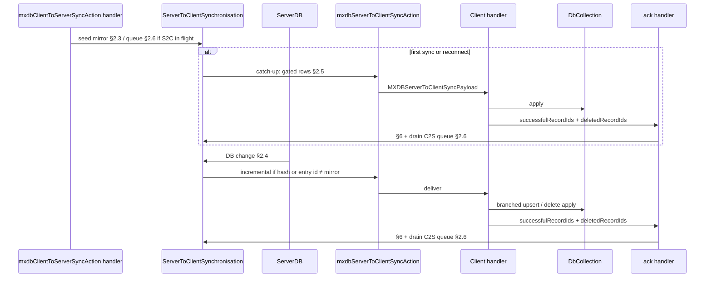

# Server→client synchronisation

This document specifies how **authoritative server state** reaches **local client storage** in MXDB-Sync: the **`mxdbServerToClientSyncAction`** path, the per-connection **`ServerToClientSynchronisation`** **mirror** of client rows, client application rules, and the **ack** the client sends back. It is the counterpart to [client-to-server-synchronisation.md](./client-to-server-synchronisation.md), which covers **`ClientToServerSynchronisation`** and **`mxdbClientToServerSyncAction`**.

Together, those two types are the **only** target mechanisms for **record** synchronisation between client and server (see client-to-server doc §3.2).

For **local-first creates** and how they interact with upsert and audit flow, see [client-record-creation-sync.md](./client-record-creation-sync.md).

> **Implementation note:** The target wire symbol is **`mxdbServerToClientSyncAction`** (socket **action** with client **ack**). **`mxdbServerPush`** / `mxdbServerRecordsUpdate` remains as a **legacy** event during migration. When in doubt, treat **this document** as the target contract.

---

## 1. Goals

- **Timely convergence**: After the server persists a change, connected clients whose **mirror** row is **stale** receive updates via **`mxdbServerToClientSyncAction`**, not via a separate periodic full-audit sync.
- **Per-connection mirror**: For each socket, **`ServerToClientSynchronisation`** stores **`(collectionName, recordId) → { recordHash, lastAuditEntryId }`**—what the server **believes** this client last had for materialised row and audit anchor (see §2.2). **`recordHash`** and **`lastAuditEntryId`** use the same meanings as the client queue and wire slice in [client-to-server-synchronisation.md](./client-to-server-synchronisation.md) §4.4 / §5–§6.
- **Why both hash and entry id**: **`lastAuditEntryId`** alone is not enough: this client’s last-sent entry id may **still match** the client’s branch while **other clients** have appended entries **before** that id in the merged audit history, so the **materialised record** on the server can differ. **`recordHash`** detects that drift; **`lastAuditEntryId`** lines up audit collapse with the server’s branch semantics.
- **Gated pushes**: The server emits an update for a tracked id only when **current server `recordHash`** or **`auditor.getLastEntryId`** (server audit) **differs** from the values stored in this socket’s mirror for that id (§2.4). **Deletes** use the same “in mirror + stale or tombstone” rules.
- **Catch-up after offline / reconnect**: When the tracked set is (re)established, the server can use the **same comparison** to include **only** rows that still **differ** from the mirror—often **smaller** than a blind full dump (§2.5).
- **Do not clobber local pending work**: If the user has **unsynced local edits** (`auditor.hasPendingChanges`), the client **must not** blindly overwrite that row; the spec’s client rules below apply together with that guard where still required.
- **Ack**: The client returns **`successfulRecordIds`** and **`deletedRecordIds`** (per collection). The server **updates** the mirror for successes and **removes** rows for deletions; **omitted** ids leave the mirror **unchanged** (§6).
- **C2S vs in-flight S2C**: Mirror rows coming from **`mxdbClientToServerSyncAction`** must **not** be merged into **`ServerToClientSynchronisation`** while an **`mxdbServerToClientSyncAction`** is **awaiting ack** for that socket—**buffer** instead (§2.6). The **`mxdbClientToServerSyncAction` response must never wait** on that buffer or on S2C ack (**deadlock** risk).
- **Order after client→server success**: On the client, applying **`mxdbServerToClientSyncAction`** must wait on the **same admission promise** (or equivalent) that [client-to-server-synchronisation.md](./client-to-server-synchronisation.md) §4.9 **phase B** resolves only after **`collapseAudit`** has finished for every **successful** id from the latest **`mxdbClientToServerSyncAction`** response—so server-driven updates never interleave **before** local audits are anchored to the **sent** **`lastAuditEntryId`**. (Phase **C** is only the next C2S debounce; it does not gate S2C.)

---

## 2. Server: `ServerToClientSynchronisation` (per connection)

### 2.1 Lifetime and context

- There is **one `ServerToClientSynchronisation` instance per connected client** (per socket / connection).
- It is exposed through the same **async context** pattern as the database handle: add it as a field on **`createAsyncContext`** (alongside **`db`**) so server code running in a connection-scoped scope can **`useServerToClientSynchronisation()`** (or equivalent) and obtain **this** connection’s instance.

### 2.2 Internal mirror

For each **`collectionName`**, the instance stores a map **`recordId` → `{ recordHash, lastAuditEntryId }`**:

```ts
// Conceptual
type ClientMirrorRow = {
  recordHash: string;
  /** ULID of the last audit entry the server believes this client has applied for this row. */
  lastAuditEntryId: string;
};

type ServerToClientMirror = Map<string, Map<string, ClientMirrorRow>>; // collectionName → recordId → row
```

**`recordHash`**: same deterministic materialised-record hash as on the client ([`hashRecord`](../../src/common/auditor/hash.ts) family). **Audit-free** collections: use an agreed substitute (e.g. content hash of LWW fields) and keep the same **pair** (`recordHash`, `lastAuditEntryId` sentinel) comparable on both sides.

### 2.3 Seeding from `mxdbClientToServerSyncAction`

When the server handles **`mxdbClientToServerSyncAction`**, for each **`(collectionName, recordId)`** in the request’s **`updates`**, compute the mirror row **`{ recordHash, lastAuditEntryId }`**: **`recordHash`** from the update; **`lastAuditEntryId`** = **`entries[entries.length - 1].id`** on the **sent** **`entries`** array after [client-to-server-synchronisation.md](./client-to-server-synchronisation.md) §6.2 (non-empty **`entries`**); this matches the client’s queued **`lastAuditEntryId`** for that snapshot.

**Idempotent replays:** If the client sends the **same** slice again (e.g. [client-to-server-synchronisation.md](./client-to-server-synchronisation.md) §5.2 lost response), upserting the same **`{ recordHash, lastAuditEntryId }`** into the mirror is **safe**—no duplicate rows in the mirror.

**Apply** that row to **`ServerToClientSynchronisation`** per §2.6: **immediately** if no S2C round is **in flight** for this socket; otherwise **enqueue** it on a per-socket **pending mirror** queue. **Do not** delay returning the **`mxdbClientToServerSyncAction`** response waiting for mirror apply or for S2C (see §2.6).

After the mirror for this batch is **either** applied **or** queued, schedule §2.5 **catch-up** only when it is safe to emit (e.g. after any queued seed is **flushed** at the next S2C ack if S2C was in flight—see §2.6).

See [client-to-server-synchronisation.md](./client-to-server-synchronisation.md) §5.2.

### 2.4 Feeding database changes (gate)

When **insert / update / delete** events are observed for subscribed collections (e.g. **`ServerDb` `onChange`** → **`clientDbWatches`**), for each changed **`(collectionName, recordId)`**:

1. If **`recordId`** is **not** in the mirror for **`collectionName`** for **this** socket, **do not** include it in **`mxdbServerToClientSyncAction`** (nothing tracked yet).
2. If it **is** tracked, compute **current server** materialised **`record`**, **`recordHash`**, and **`lastAuditEntryId`** = `auditor.getLastEntryId(serverAudit)` (or equivalent for audit-free).
3. Compare to the mirror row **`{ recordHash, lastAuditEntryId }`**:
   - If **either** value **differs** from the server’s current values → the client is **stale** → **include** in the outgoing payload (**`UpdatedRecord`** with **`record`** + **`lastAuditEntryId`**, or **`DeletedRecord`** if the server row is deleted—see below).
   - If **both** **match** → **omit** (no push for that id in this batch).

**Deletes**: If the server has **removed** the row, compare mirror expectations to the **tombstone** state; when the client must receive the delete, emit **`DeletedRecord`** with **`lastAuditEntryId`** = the **Deleted** entry’s ULID on the server.

Emit **`mxdbServerToClientSyncAction`** when at least one id is included, using the array payload shape in §3 (**one array element per collection** with work).

### 2.5 Catch-up snapshot (first sync or reconnect)

When a client **first** synchronises or **reconnects**, the mirror is (re)populated from **`mxdbClientToServerSyncAction`** (§2.3) or an equivalent handshake.

**Immediately after** that, and **only once** per such **connection episode** (e.g. **`pendingCatchUp`** flag), **enumerate every** tracked **`(collectionName, recordId)`** and apply the **same gate as §2.4**: include in **one** (or chunked) **`mxdbServerToClientSyncAction`** only ids where server **hash** or **lastAuditEntryId** still **differ** from the mirror. That often yields a **smaller** catch-up than blind full replication when the mirror is already close to server truth.

- Do **not** repeat this full catch-up pass after **every** C2S batch—only when **first** establishing or **re**establishing tracking for **first sync** or **reconnect**.
- After catch-up, **§2.4** drives incremental pushes.

### 2.6 Mirror updates from C2S while S2C is in flight

**In-flight S2C:** For each socket, treat **`mxdbServerToClientSyncAction`** as **in flight** from **`emit`** until the **`ServerToClientSyncAck`** for that emit is **processed** (at most **one** in-flight S2C per socket at a time; if you pipeline multiple emits, define ordering explicitly).

**Rule:** While S2C is in flight, **do not** synchronously **upsert** mirror rows derived from **`mxdbClientToServerSyncAction`** into **`ServerToClientSynchronisation`**. **Enqueue** each pending **`(collectionName, recordId, recordHash, lastAuditEntryId)`** (or an equivalent delta) on a **per-socket queue**—mirror shape as §2.2 (from the client snapshot’s **`lastAuditEntryId`**, §4.4). When S2C is **not** in flight, apply §2.3 **immediately** as usual.

**No deadlock:** The **`mxdbClientToServerSyncAction`** handler **must** return its normal **response** (merge result, **`successfulRecordIds`**, etc.) as soon as **server persistence** and handler work for C2S are done—**without** `await`ing:
- the **S2C client ack**, or
- a **synchronous flush** of **`ServerToClientSynchronisation`** that is **blocked** on that ack.

Queuing mirror updates is **non-blocking**; the client can receive the C2S response while S2C is still outstanding.

**When the S2C ack arrives** (§6): After updating the mirror from **`successfulRecordIds`** / **`deletedRecordIds`**, **drain** the **pending mirror queue** for that socket (merge rows into the mirror; on duplicate **`(collectionName, recordId)`**, last queued values win unless you define otherwise), then clear **in-flight** S2C. If **§2.5** **`pendingCatchUp`** was waiting on a **queued** C2S seed, run catch-up **after** this drain.

**Emitting S2C:** Set **in flight** before **`emit`**; clear only after ack handling (including queue drain) completes.

### 2.7 Delivery failure or lost ack (socket still connected)

If **`mxdbServerToClientSyncAction`** **fails** to deliver, or the **ack** never arrives, **while the socket is still considered connected**, **`ServerToClientSynchronisation`** should run a **§2.5-style catch-up** again: **enumerate** every tracked **`(collectionName, recordId)`** and apply the **same gate as §2.4**, emitting **one** (or chunked) **`mxdbServerToClientSyncAction`** for ids still **stale** relative to the mirror. The client may have missed a push; this **reconciles** the server’s view of what they still need.

If the **client has disconnected**, there is **no** point in continuing catch-up on that **connection**; tear down or park the instance. On **reconnect**, a **new** **`ServerToClientSynchronisation`** (or a reconnect handshake on the same scope) runs **§2.5** anyway, so the client is brought up to date with everything the server believes they should have.

---

## 3. Wire payload: `mxdbServerToClientSyncAction`

**`MXDBServerToClientSyncPayload`** is an **array**: **one element for each collection** that has at least one item to send for this emit. Each element carries **`collectionName`**, **`updates`**, and **`deletions`**.

```ts
/** Top-level payload: one entry per collection with work to send for this client. */
type MXDBServerToClientSyncPayload = MXDBServerToClientSyncPayloadItem[];

interface MXDBServerToClientSyncPayloadItem {
  collectionName: string;
  updates: UpdatedRecord[];
  deletions: DeletedRecord[];
}

interface UpdatedRecord {
  record: Record;
  /** Server’s latest audit entry ULID for this materialised row after the write. */
  lastAuditEntryId: string;
}

interface DeletedRecord {
  recordId: string;
  /** ULID of the Deleted audit entry on the server (the delete entry’s id). */
  lastAuditEntryId: string;
}
```

If a single emit only touches **one** collection, the payload is a **one-element array**.

**Audit-free** collections (`disableAudit`): define **`lastAuditEntryId`** with an agreed sentinel or map to LWW timestamps if you cannot use ULIDs; the client apply path must stay consistent with [§4](#4-client-applying-mxdbservertoclientsyncaction).

---

## 4. Client: applying `mxdbServerToClientSyncAction`

The client handler (today’s role: **`ServerToClientProvider`**) receives **`MXDBServerToClientSyncPayload`** (an **array**). For **each** **`MXDBServerToClientSyncPayloadItem`**, resolve **`db.use(collectionName)`** and process **`updates`** and **`deletions`**.

### 4.1 Pending guard

Where the product still requires it: if **`existingAudit != null && auditor.hasPendingChanges(existingAudit)`**, **do not** apply the server payload for that id in a way that **drops** pending user work (same intent as today’s push guard).

### 4.2 Updates

For each **`UpdatedRecord`** (`record` + **`lastAuditEntryId`**):

1. If the pending guard allows, apply the server materialisation using your existing **branched** reconciliation: e.g. **`collection.upsert(record, 'branched', lastAuditEntryId)`** (see [`DbCollection.upsert`](../../src/client/providers/dbs/DbCollection.ts)) so local audit anchors to the server’s **`lastAuditEntryId`**.

### 4.3 Deletions

For each **`DeletedRecord`** (`recordId` + **`lastAuditEntryId`** of the delete entry):

1. Align local audit with the server delete (collapse / insert **Deleted** entry with that **`lastAuditEntryId`** in entry order, same family of rules as earlier specs); remove the live row when the audit implies removal.
2. If the last entry is the server’s delete and the audit can be reduced to **Branched + Deleted** only, you may drop the audit entirely.

---

## 5. Ack from the same action

The client **responds** on the **`mxdbServerToClientSyncAction`** acknowledgement channel (or a sibling ack action) **per collection**:

```ts
type ServerToClientSyncAck = Array<{
  collectionName: string;
  /** Ids whose updates (§4.2) were applied locally with no issue. */
  successfulRecordIds: string[];
  /** Ids fully removed client-side after server deletions (§4.3). */
  deletedRecordIds: string[];
}>;
```

- **`successfulRecordIds`**: rows the client **materialised** from **`updates`** for this payload (or a defined subset if partial apply is allowed—product choice).
- **`deletedRecordIds`**: rows **removed** locally per **`deletions`**.
- An id **present in the outgoing S2C batch** but **omitted** from **both** lists (e.g. skipped due to pending guard): the server **does not** change the mirror for that id (§6).

---

## 6. Server: applying the ack inside `ServerToClientSynchronisation`

When the **ack** arrives for a connection:

1. **`deletedRecordIds`**: For each **`recordId`** under **`collectionName`**, **remove** that id from the mirror (no **`recordHash` / `lastAuditEntryId`** row). The client is no longer subscribed to S2C for that id until **registered** again (e.g. a future **`mxdbClientToServerSyncAction`**).

2. **`successfulRecordIds`**: For each **`recordId`** under **`collectionName`** that appears in the ack, **refresh** the mirror row from **current server database state** for that id: set **`recordHash`** and **`lastAuditEntryId`** to the server’s **authoritative** values after the client has (in principle) matched the pushed payload. This aligns the mirror for **reconnect** and **multi-client interleaving** so subsequent **§2.4** comparisons start from a **true** server baseline.

3. **Omitted ids**: If an id was **included** in the S2C message the client is acknowledging but appears in **neither** **`successfulRecordIds`** nor **`deletedRecordIds`**, **leave** the mirror row **unchanged** (the server still assumes the previous **`recordHash` / `lastAuditEntryId`** for that socket).

4. **Drain C2S mirror queue** (§2.6): Apply any **pending** **`mxdbClientToServerSyncAction`** mirror rows that were **buffered** while this S2C round was in flight; then mark S2C **no longer in flight**. If **§2.5** catch-up was deferred until the mirror was fully seeded, run it **after** this step when appropriate.

---

## 7. Sole sync surface (with client-to-server)

| Mechanism | Direction | Use |
|-----------|-----------|-----|
| **`mxdbClientToServerSyncAction`** + **`ClientToServerSynchronisation`** | Client → server | Batched audit push; seeds **mirror** in **`ServerToClientSynchronisation`** (§2.3, **§2.6** if S2C in flight); response **not** blocked on mirror flush ([client-to-server-synchronisation.md](./client-to-server-synchronisation.md)). |
| **`mxdbServerToClientSyncAction`** + **`ServerToClientSynchronisation`** | Server → client (ack **`successfulRecordIds`** + **`deletedRecordIds`**, §5–§6) | **Gated** pushes (§2.4); payload **`UpdatedRecord`** / **`DeletedRecord`** (§3). |

**`mxdbSyncCollectionsAction`** / full-audit **`synchronise-collections`** is **not** part of the target design for record sync; it is **superseded** by the pair above (see [client-to-server-synchronisation.md](./client-to-server-synchronisation.md) §3.2 and §7.4).

---

## 8. Sequence (target path)



---

## 9. Non-goals and follow-ups

- **Client-side connection and C2S debounce**: **`onConnectionChanged`**, **`MXDBSync`** mount/unmount, and **`ClientToServerSynchronisation`** lifecycle are specified in [client-to-server-synchronisation.md](./client-to-server-synchronisation.md) §4.1–§4.3 (this doc only assumes C2S batches arrive when the client is allowed to send).
- **Transport details**: exact **timeouts**, **retry** policy, and backoff when **`mxdbServerToClientSyncAction`** emit or ack fails (beyond §2.7); how “**still connected**” is detected at the socket layer.
- **Duplicate S2C payloads**: whether the client can receive the **same** emit twice and how apply/ack should **dedupe** if needed (beyond §4 pending guard).
- Comprehensive updates to **`tests/sync-test`** scenarios when the target wiring lands.
- Whether multiple **in-flight** S2C rounds per socket are ever allowed (this spec assumes **one** at a time—§2.6).

---

## 10. Related files (maintainer index)

| Topic | File / area |
|--------|-------------|
| Client→server batch, queue, **`lastAuditEntryId`** / **`entries`**, **`MXDBSync`** / **`onConnectionChanged`** | [client-to-server-synchronisation.md](./client-to-server-synchronisation.md) (§4.1, §5.1) |
| Target payload types | `src/common/models` (align with §3) |
| **`mxdbServerToClientSyncAction`** symbol | `src/common/internalActions.ts` (server **`useAction`**, client **`useServerActionHandler`**) |
| Other server→client **events** | `src/common/internalEvents.ts` (`mxdbServerPush`, `mxdbRefreshQuery`, `mxdbTokenRotated`) |
| Per-connection instance + async context | `src/server/providers/db/DbContext.ts` (or adjacent context module) + connection setup |
| DB → per-socket fan-out | `src/server/clientDbWatches.ts` |
| Client apply + ack | `src/client/providers/server-to-client/ServerToClientProvider.tsx` |
| Record hash helper | [`hash.ts`](../../src/common/auditor/hash.ts) |
| Create / first upsert narrative | [client-record-creation-sync.md](./client-record-creation-sync.md) |

---

**Integration overview:** [README.md](../README.md) · **Client:** [client-guide.md](../guides/client-guide.md) · **Server:** [server-guide.md](../guides/server-guide.md) · **API index:** [features.md](../reference/features.md)
