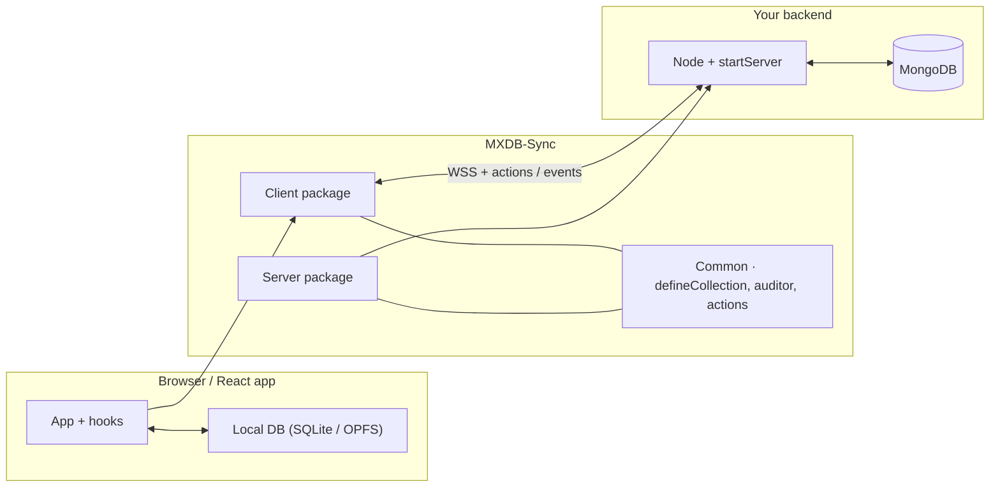
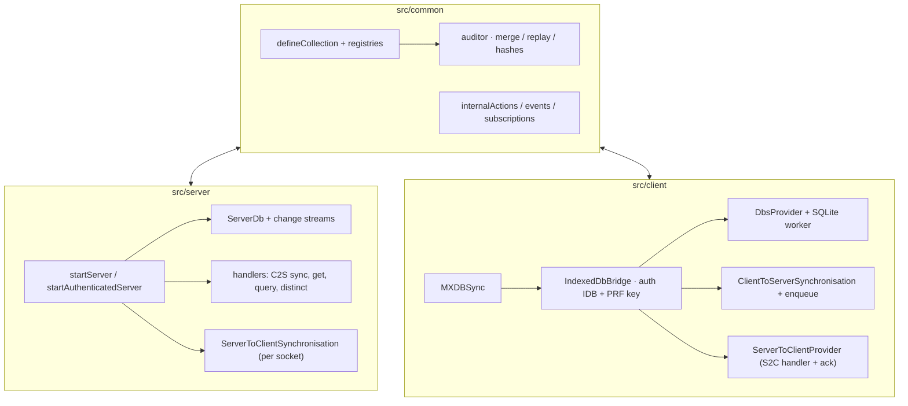
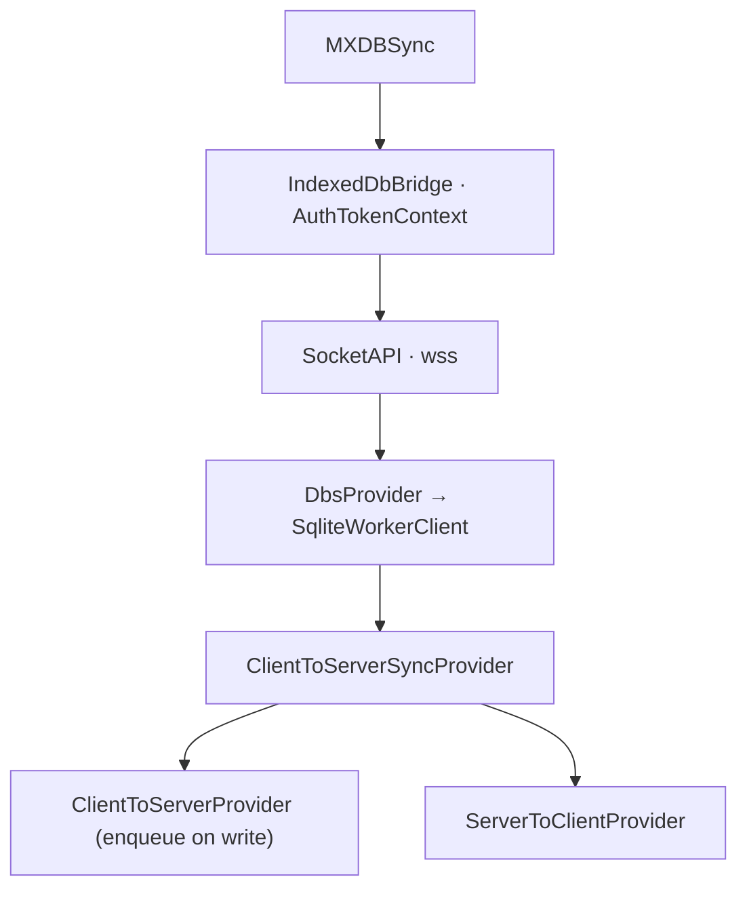
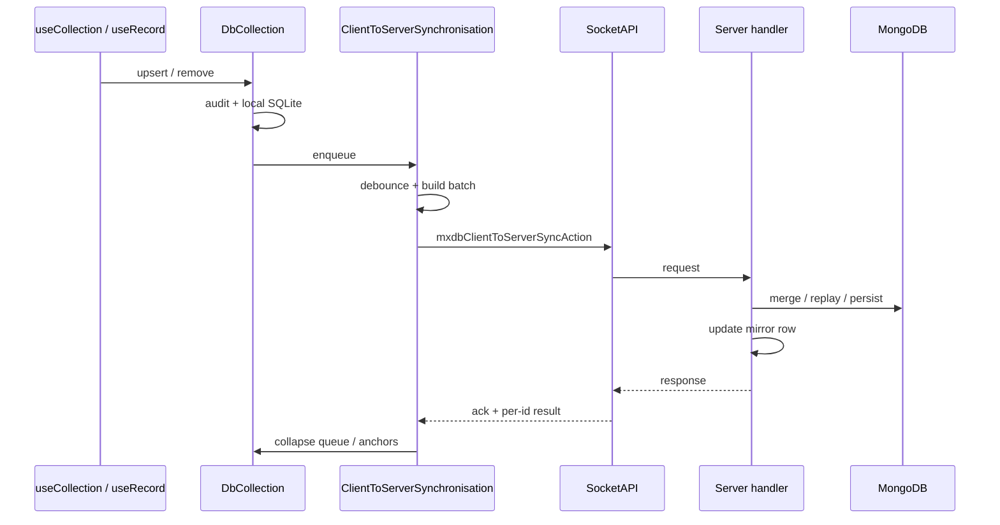
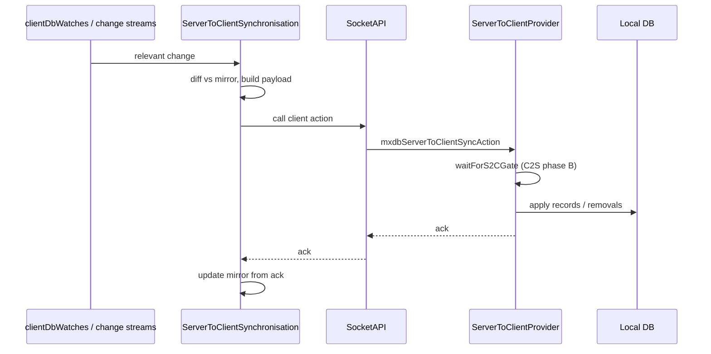
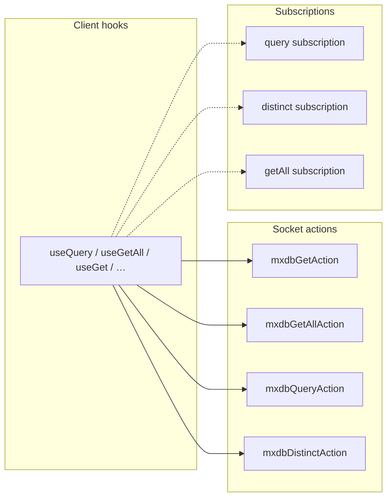

# Technical overview

High-level picture of **MXDB-Sync**: how the **common**, **client**, and **server** pieces fit together, how data moves, and where to read more. For integration steps see [client-guide.md](../guides/client-guide.md) and [server-guide.md](../guides/server-guide.md). For symbol-level detail see [features.md](./features.md). Normative sync behaviour is in [plans/client-to-server-synchronisation.md](../plans/client-to-server-synchronisation.md) and [plans/server-to-client-synchronisation.md](../plans/server-to-client-synchronisation.md).

---

## 1. System context

The library connects **React clients** (local SQLite per user, encrypted at rest when a key is available) to a **Node server** backed by **MongoDB**. The real-time link is **Socket.IO** via **socket-api** (`defineAction` / `defineEvent`).

---

## 2. Logical layers

Shared **collection definitions** and **auditor** logic live in `common`. The server materialises the same conceptual model in MongoDB (live + audit where enabled). The client keeps a **local replica** and an **audit trail** used for merge, replay, and sync payloads.

---

## 3. Client provider stack (authenticated session)

When the user has a stored auth entry, **IndexedDbBridge** derives the encryption key, opens **SocketAPI**, **DbsProvider**, and nests **C2S** / **S2C** providers. **TokenRotationProvider** sits under **MXDBSync** (outside this subgraph) to react to rotated tokens.

Unauthenticated users still get **AuthTokenContext** (e.g. registration / invite) without the inner socket + DB tree.

---

## 4. Client → server: batched audit push

Local **upsert/remove** append to the audit and **enqueue** work for **ClientToServerSynchronisation**. A debounced batch is sent as **`mxdbClientToServerSyncAction`**. The server replays audits into MongoDB and updates its **S2C mirror** for that socket. The client collapses queue state from the response (see the C2S plan for phases and idempotency).

---

## 5. Server → client: action + ack

The server decides when to push updates (e.g. after other clients’ writes, informed by **change streams** and the per-connection **mirror**). It invokes **`mxdbServerToClientSyncAction`** on the client; the client applies payloads **after** the C2S “phase B” gate when required, then returns an **ack** (`successfulRecordIds`, `deletedRecordIds`, …) so the server can advance its mirror.

---

## 6. Reads and subscriptions

Besides sync, clients fetch data with **actions** (**get**, **getAll**, **query**, **distinct**) and can hold **subscriptions** for long-lived **query**, **distinct**, and **get-all** streams. Those paths talk to the server over the same socket abstraction; results hydrate or refresh local state according to the hook implementation (**`useQuery`**, **`useDistinct`**, **`useGetAll`** mirror the same pattern).

---

## 7. Where to go next

| Topic | Document |
|--------|-----------|
| Mounting, hooks, auth | [client-guide.md](../guides/client-guide.md) |
| `startServer`, MongoDB, extensions | [server-guide.md](../guides/server-guide.md) |
| Exports and handler registration | [features.md](./features.md) |
| C2S queue, debounce, idempotent replay | [plans/client-to-server-synchronisation.md](../plans/client-to-server-synchronisation.md) |
| S2C mirror, ack, gating | [plans/server-to-client-synchronisation.md](../plans/server-to-client-synchronisation.md) |
| Auditor, storage, platforms | [plans/design.md](../plans/design.md) |
